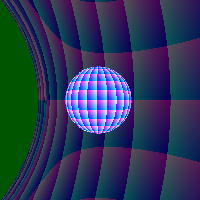

# RayTraceGR.jl

[](https://github.com/eschnett/RayTraceGR.jl/actions)




This is a relativistic [ray
tracer](https://en.wikipedia.org/wiki/Ray_tracing_(graphics)). The
examples below show how spheres look, either in a flat spacetime or
near a black hole.


## Examples

### Example 1: Sphere in a flat spacetime

```Julia
using RayTraceGR
RayTraceGR.example1()
```

The output is a PNG file `scenes/sphere.png`.

### Example 2: Sphere near a black hole

```Julia
using RayTraceGR
RayTraceGR.example2()
```

The output is a PNG file `scenes/sphere2.png`.

The code is multi-threaded. If you start Julia with the environment
variable `JULIA_NUM_THREADS` set correspondingly, the code should run
faster.


## Algorithm

A scene consists of a background spacetime, several objects that emit
light, and a screen that captures photons.

In the basic tay tracing algorithm, one starts from the pixels of the
screen where the photons are absorbed, and traces the rays backwards
in time to see where they emanated.

- The spacetime is defined by its
  [metric](https://en.wikipedia.org/wiki/Metric_tensor_(general_relativity)),
  which defines how light rays move. A flat spacetime is trivial
  (light rays move along straight lines). Other spacetimes may
  describe [black holes](https://en.wikipedia.org/wiki/Black_hole),
  [wormholes](https://en.wikipedia.org/wiki/Wormhole), or more exotic
  settings.

- The objects are the light sources, i.e. the things that are visible
  in a scene. When a light ray intersects an object, one calculates
  where on the object it intersects. By defining which part of an
  object has what colour, one thus knows what colour the photon is.

- The screen consists of a rectangular array of pixels. The screen is
  probably slightly curved, so that you get a certain field of view.

Light rays are traced by solving the [geodesic
equation](https://en.wikipedia.org/wiki/Geodesics_in_general_relativity)
with an [ODE
solver](https://en.wikipedia.org/wiki/Ordinary_differential_equation).
This is the physically correct way to trace light rays, and it works
with arbitrary metrics.

If I find the time, I might trace rays in a numerically calculated
spacetime, such as coalescing [binary black
holes](https://en.wikipedia.org/wiki/Binary_black_hole) as e.g.
calculated via the [Einstein
Toolkit](http://einsteintoolkit.org/gallery/bbh/index.html).


## Modifying the scene

It is not (yet?) possible to specify a scene via a parameter file.
Instead, the scene is described as Julia code.

The code has two metrics built in, a flat spacetime (`minkowski`) and
a rotating black hole
([`kerr_schild`](https://en.wikipedia.org/wiki/Kerr_metric)). The
black hole can have a varying mass (`M`) and spin (`a`).

You specify the objects and their locations, as well as the screen.
For example, `example2` specifies:

- 3 Objects: A large sphere as background sky (`caelum`) with radius
  `10`, a [cut-off plane](https://en.wikipedia.org/wiki/Frustum) in
  the past (`frustum`) at time `-20`, and a visible sphere (`sphere`)
  sitting net to the black hole
- A screen with a certain width and height, with a view angle of 90°


## Implementation details

### Coordinates

The code uses Cartesian coordinates `t, x, y, z` since these have no
coordinate singularities. Many black hole metrics are specified in
spherical coordinates `t, r, θ, ϕ`, since the metric looks then much
simpler. However, this makes the `z` axis a considerable source of
headache.

### Derivatives

Specifying the metric of the spacetime is difficult enough (it's eight
lines of equations for the black hole metric), but one also needs the
derivatives of the metric for the Christoffel symbols in the geodesic
equation. I implemented [dual
numbers](https://en.wikipedia.org/wiki/Dual_number) for this, which
makes is straightforward to calculate derivatives (see the function
`dmetric`).

The Julia package
[DualNumbers.jl](https://github.com/JuliaDiff/DualNumbers.jl/blob/master/src/dual.jl)
is not generic enough, as it doesn't allow using vectors as the dual
part. The package
[ForwardDiff.jl](https://github.com/JuliaDiff/ForwardDiff.jl) seems to
support this; I should probably use it instead of my home-grown code.

### Parallelization

Ray tracing is "naturally parallel", and it would be a shame to run it
serially. I experimented with distributed programming, but got stuck
ensuring that the other Julia kernels see both the source code and its
dependencies (external packages). Multi-threading was much easier to
set up, so I did that.
